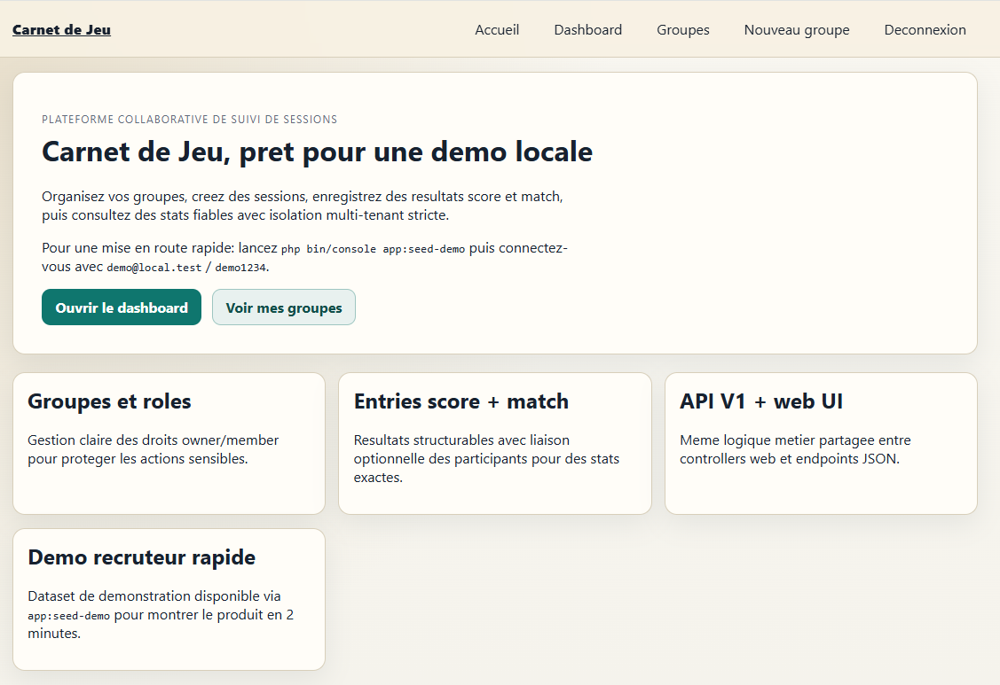
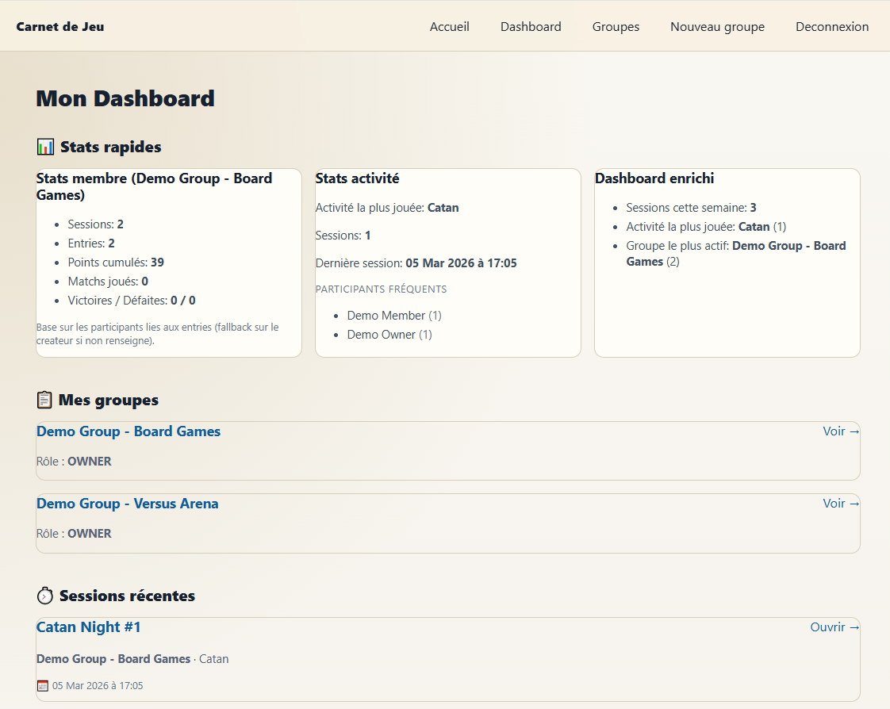
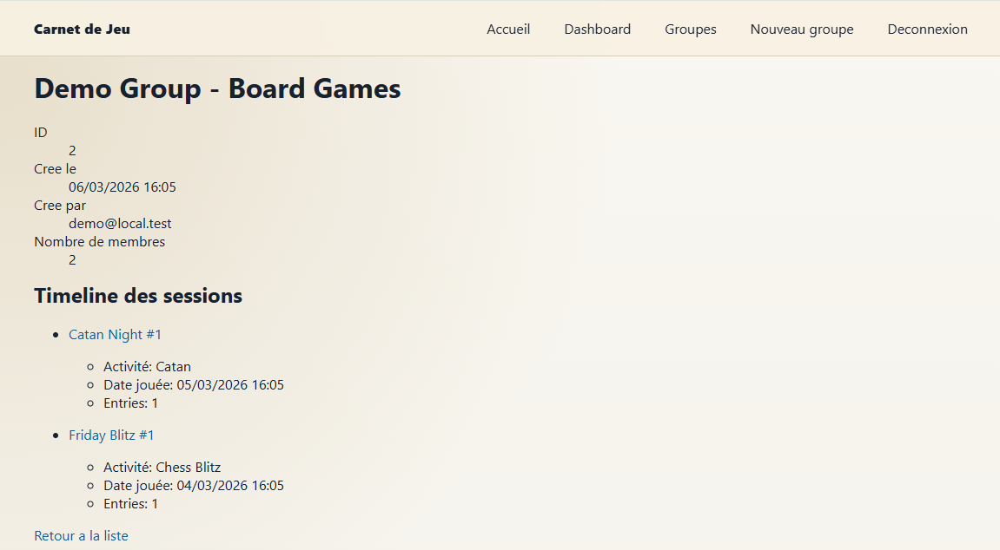
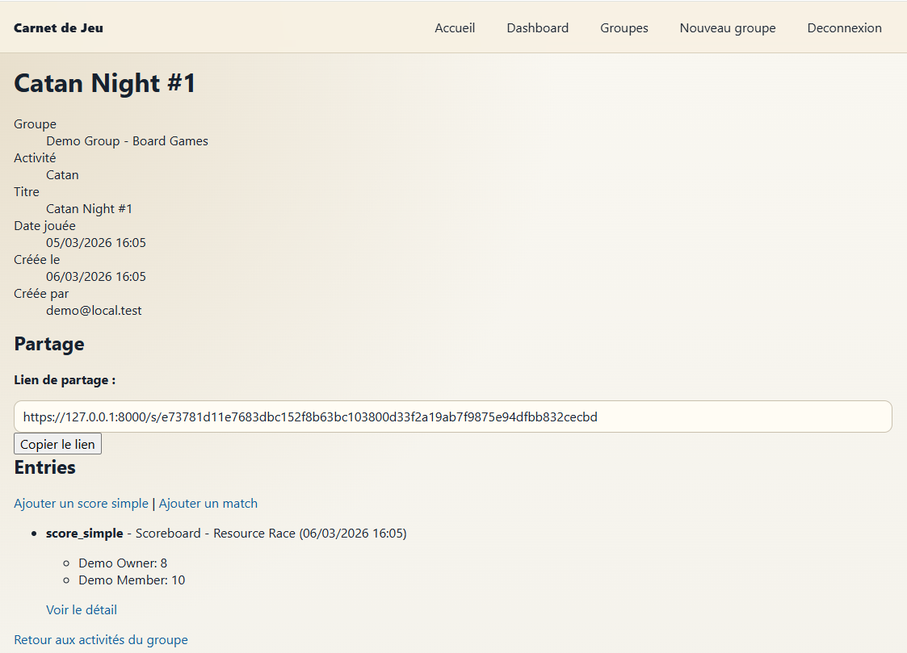

# 🎲 Carnet de Jeu


> Une application web pour gérer vos groupes de joueurs, suivre vos sessions de jeu et consolider vos statistiques — le tout avec une isolation multi-tenant rigoureuse.



---

## 🚀 Démarrage rapide

```bash
# Installation
composer install
php bin/console doctrine:migrations:migrate --no-interaction

# Données de démo (2 utilisateurs, 2 groupes, sessions pré-remplies)
php bin/console app:seed-demo

# Lancement
symfony server:start
# ou: php -S 127.0.0.1:8000 -t public
```

**Comptes de test** :
- `demo@local.test` / `demo1234`
- `demo.member@local.test` / `demo1234`

---

## 📖 À propos du projet

**Carnet de Jeu** centralise l'organisation de sessions de jeu en groupe : créez vos groupes, invitez des membres, planifiez des activités, enregistrez vos résultats (scores simples ou matchs) et consultez vos statistiques.

### Cas d'usage typique
1. Un groupe d'amis joue régulièrement à différents jeux
2. Ils veulent suivre leurs sessions, leurs scores, et savoir qui gagne le plus
3. Chaque groupe reste isolé — pas de fuite de données entre groupes
4. Les stats individuelles sont fiables grâce aux liaisons utilisateur/score

### Problème résolu
**Isolation stricte** : un utilisateur peut être membre de plusieurs groupes, mais ne voit que les données des groupes auxquels il appartient. Les entrées de score peuvent être liées à un membre spécifique, garantissant des statistiques fiables.

---

## 🎯 Fonctionnalités principales

✅ **Authentification flexible** : Login classique (email/password) + OAuth Google optionnel  
✅ **Gestion de groupes** : Création, invitations, rôles (`OWNER`/`MEMBER`)  
✅ **Activités & Sessions** : Planifiez vos rendez-vous de jeu avec date/heure  
✅ **Entrées de résultats** :
   - **Score simple** : participants + score  
   - **Match** : équipe domicile vs extérieur avec liaison optionnelle aux membres  
✅ **Partage public** : Générez un lien sécurisé avec token pour partager une session en lecture seule  
✅ **API JSON v1** : Endpoints REST documentés (`/api/groups`, `/api/sessions`, etc.)  
✅ **Tests automatisés** : 146 tests PHPUnit (561 assertions)

---

## 📸 Aperçu visuel

### Dashboard personnel


### Vue groupe


### Détail session avec entrées


---

## 🏗️ Architecture technique

Organisation en couches pour séparer métier, orchestration et transport :

```
┌─────────────────────────────────────────┐
│  UI Layer (Controllers + Twig)         │
├─────────────────────────────────────────┤
│  Application Layer (Commands/Queries)  │
├─────────────────────────────────────────┤
│  Domain Layer (Entities + Rules)       │
├─────────────────────────────────────────┤
│  Infrastructure (Doctrine + OAuth)     │
└─────────────────────────────────────────┘
```

**Points techniques intéressants** :
- **Handlers métier réutilisables** : les mêmes handlers sont appelés par les contrôleurs web ET l'API JSON
- **Multi-tenant strict** : chaque requête vérifie l'appartenance au groupe via un `GroupVoter`
- **ACL granulaires** : droits `VIEW` (tous les membres) et `MANAGE` (owner uniquement)
- **Validation cross-group** : impossible de lier un utilisateur externe au groupe dans une entrée
- **Seed idempotent** : `app:seed-demo` peut être relancé sans erreur

### Stack technique
- **Backend** : PHP 8.5 + Symfony 7
- **ORM/DB** : Doctrine ORM + SQLite (dev/test)
- **Frontend** : Twig + Stimulus + CSS
- **Tests** : PHPUnit (functional + integration + API)
- **Auth** : Symfony Security + KnpUOAuth2ClientBundle (Google)

---

## 📚 Documentation complète

- **API REST v1** : [`docs/api-v1.md`](docs/api-v1.md)
- **OAuth Google Setup** : [`docs/OAuth-Google-Setup.md`](docs/OAuth-Google-Setup.md)

### Exemples d'endpoints API
```http
GET    /api/groups
POST   /api/groups/{groupId}/activities
POST   /api/groups/{groupId}/sessions
POST   /api/groups/{groupId}/sessions/{sessionId}/entries/score-simple
POST   /api/groups/{groupId}/sessions/{sessionId}/entries/match
```

Toutes les erreurs retournent un JSON standardisé :
```json
{
  "code": "GROUP_NOT_FOUND",
  "message": "Group not found or access denied"
}
```

---

## 🔒 Sécurité & Isolation

- ✅ Vérification des droits via `Voter` Symfony
- ✅ Validation stricte des ressources cross-group (anti resource forgery)
- ✅ Headers HTTP de sécurité + CSP progressive par environnement (`report-only` en dev/test, `enforce + report-only` en prod)
- ✅ Un utilisateur **ne peut pas** :
  - Lire un groupe dont il n'est pas membre
  - Gérer des ressources sans être `OWNER`
  - Lier des utilisateurs externes au groupe dans les entrées
- ✅ Nouveau `APP_SECRET` généré (incident GitGuardian résolu — voir [`CLEANUP-REPORT.md`](CLEANUP-REPORT.md))

---

## 🧪 Tests

```bash
php bin/phpunit
```

**Couverture actuelle** : 146 tests | 561 assertions  
- Tests fonctionnels (DbWebTestCase)
- Tests de contrôleurs web
- Tests API JSON
- Tests de sécurité (accès, isolation)

---

## 🎬 Démo guidée (5-8 min)

**Parcours recommandé pour une présentation** :

1. **Homepage** → Positionnement produit + CTA
2. **Login** (`demo@local.test` / `demo1234`) → Dashboard
3. **Dashboard** → Vue globale (groupes, sessions récentes, stats)
4. **Groupe** → Naviguer vers activités et sessions
5. **Session** → Créer des entrées (`score_simple` puis `match`)
6. **Profil membre** → Consulter les stats individuelles
7. **Partage public** → Activer le lien `/s/{token}` en lecture seule
8. **API JSON** → `GET /api/groups` + un endpoint write

**Commandes utiles avant démo** :
```bash
php bin/console app:seed-demo
php bin/phpunit --testdox
```

---

## ⚙️ Configuration

### Variables d'environnement
Fichier principal : `.env` (overridé par `.env.local` en local)

| Variable | Description | Obligatoire |
|----------|-------------|-------------|
| `APP_ENV` | Environnement (`dev`, `prod`) | Oui |
| `APP_SECRET` | Secret Symfony (64 caractères hex) | Oui |
| `DATABASE_URL` | DSN de la base de données | Oui |
| `MAILER_DSN` | DSN du mailer Symfony | Non |
| `GOOGLE_CLIENT_ID` | Client ID OAuth Google | Si OAuth actif |
| `GOOGLE_CLIENT_SECRET` | Secret OAuth Google | Si OAuth actif |

**Bonnes pratiques** :
- Gardez les secrets dans `.env.local` (jamais commité)
- Utilisez une base SQLite dédiée pour le dev
- Vérifiez l'installation sur un clone neuf avant de partager

---

## 📦 Checklist avant release

- [ ] Page d'accueil lisible sans erreur visuelle
- [ ] Navigation complète sans impasse (retours dashboard/groupe/session)
- [ ] Seed demo exécuté et vérifié (`app:seed-demo`)
- [ ] Compte demo classique fonctionnel
- [ ] README relu en mode recruteur
- [ ] Variables d'environnement nettoyées (`.env`/`.env.local`)
- [ ] Installation testée de zéro (clone → migrations → seed → login)
- [ ] Tests passent : `php bin/phpunit`

---

## 🚀 Roadmap

- [ ] OpenAPI/Swagger automatique
- [ ] Pagination API
- [ ] Filtres et tris avancés
- [ ] Exports CSV/JSON des sessions
- [ ] Statistiques avancées par membre et activité
- [ ] Refonte UI avec framework moderne

---

## 📄 Licence

Ce projet est sous licence MIT.

